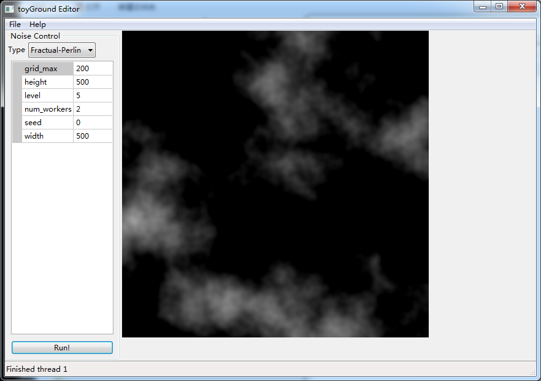

# toyGround
Graphics toy collections for libreliu

## Current implemented
- `noise`: a library for generating various noises
  - Uniform Noise
  - Perlin Noise
  - Fractual Noise
  - Worley Noise
  - Composite of above
- `noise_test`: a test program that runs in the console
  - Implements all of above + PictureBlender(Masking/Linear composition)
- `editor`: a wxWidgets based GUI editor, for playing with the above
  - Multi-threaded
## Screenshot


## Install (New!)
I've switched the workflow to Conan, since wxWidgets build well in Conan for all platforms. (Thanks to bincrafters.)

### Conan Practices
1. I've used the CMake target method to avoid linking wxWidgets to all of the projects.
2. I've used CMakeLists to do conan install automatically, but **no conanfile.txt modification detection** for now.

## Install
Build and run under Ubuntu 18.04:
```
sudo apt install build-essential libwxgtk3.0-dev
mkdir build && cd build && cmake ..
make
./editor/editor
```

Build with MSVC 2019:
> vcpkg's wxWidgets support is currently broken.
> Use native packages instead.
1. Make sure you've got CMake installed
2. Download *Windows Installer* from [WxWidgets Website](https://www.wxwidgets.org/downloads/)
  - I'm using the wxWidgets 3.1.3, but all wxWidgets >= 3.0 should work.
3. Run Configure & Generate from CMake GUI, with the correct source folder set (e.g. `C:\wxWidgets-3.1.3`)
4. Open the generated project with **Administrator-privileged** VS2019, and generate the "INSTALL" target.
  - Make one for `Debug`, and one for `Release`
  - Then something like `C:\Program Files (x86)\wxWidgets` should appear
5. CMake will search `C:\Program Files (x86)` automatically, so now you should be able to compile this project
6. Add things like `C:\Program Files (x86)\wxWidgets\lib\vc_x64_dll` in your `Path` (Environment Variable) to resolve dynamic linking failures.